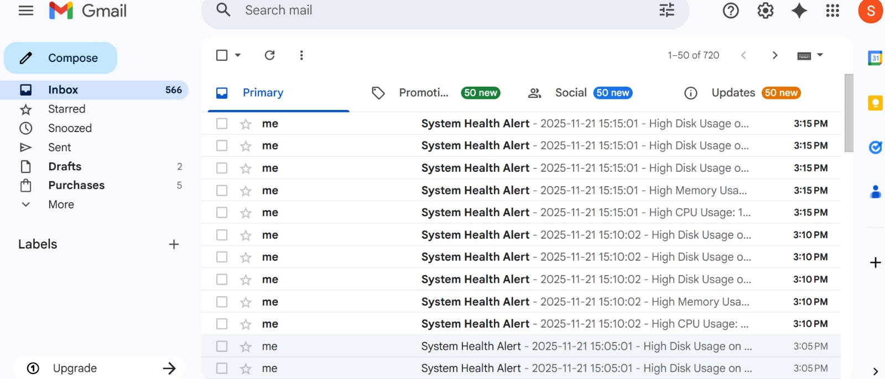
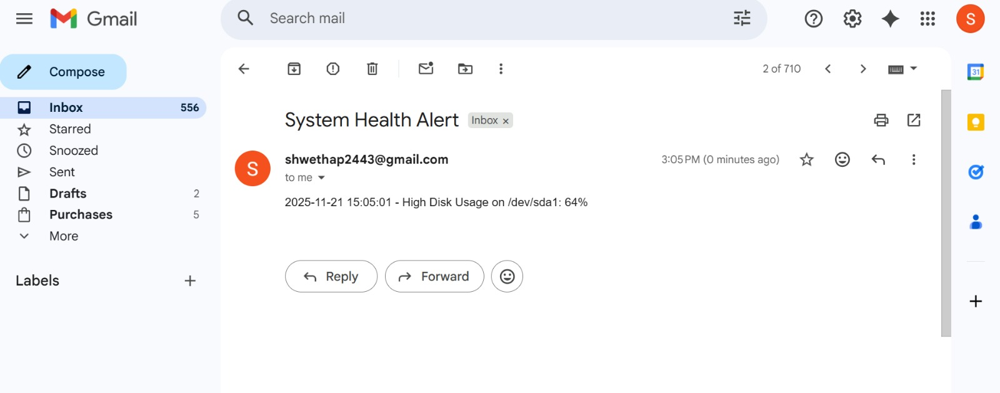

# Linux System Health Monitoring and Alert Script

A **Bash script** to monitor Linux server health, track CPU, memory, and disk usage, and send email alerts when thresholds are exceeded. Logs system health and resource usage for easy monitoring.

---

## Features

* Monitors **CPU, Memory, and Disk usage**
* Logs system health to `/var/log/system_health.log`
* Sends **email alerts** when usage exceeds thresholds (default: 60%)
* Tracks **Top 5 CPU and Memory consuming processes**
* Fully **automatable with cron jobs**

---

## Script Thresholds

* **CPU Threshold:** 60%
* **Memory Threshold:** 60%
* **Disk Usage Threshold:** 60%

> These can be updated in the script variables at the top:
>
> ```bash
> CPU_THRESHOLD=60
> MEM_THRESHOLD=60
> DISK_THRESHOLD=60
> ```

---

## Technologies Used

* Bash scripting
* Linux commands: `top`, `free`, `df`, `ps`
* Email alerts using `msmtp`
* Logging to `/var/log/system_health.log`
* Cron jobs for automation

---

## Setup & Usage

1. **Clone the repository:**

```bash
git clone https://github.com/Shwetha24-SDE/Linux-Health-Project.git
cd Linux-Health-Project
```

2. **Make the script executable:**

```bash
chmod +x health_check.sh
```

3. **Run the script manually:**

```bash
./health_check.sh
```

4. **Set up a cron job for automatic monitoring (example: every 10 minutes):**

```bash
crontab -e
```

Add the line:

```bash
*/10 * * * * /path/to/health_check.sh
```

---

## Sample Log Output

```text
2026-04-07 10:00:00 - CPU Usage: 72%
2026-04-07 10:00:00 - Memory Usage: 65%
2026-04-07 10:00:00 - Disk Usage on /: 78%

2026-04-07 10:00:00 - Top 5 CPU consuming processes:
PID   PPID   CMD       %MEM  %CPU
1234  1      java      10    25
2345  1      python     5    15

2026-04-07 10:00:00 - Top 5 Memory consuming processes:
PID   PPID   CMD       %MEM  %CPU
2345  1      python     5    15
1234  1      java      10    25
```

---

## Sample Output

### System Health Log Output


### Email Alert


> This will display your script output directly in the README.

---

## Email Alert Example

```text
Subject: ALERT: High CPU Usage on Server
Body:
2026-04-07 10:00:00 - High CPU Usage: 72%
Please take necessary action.
```

---

## Contributing

Contributions are welcome!
Feel free to submit pull requests for new features or improvements, such as:

* Adding configurable email settings
* Adding alert for network usage
* Improving log format

---


